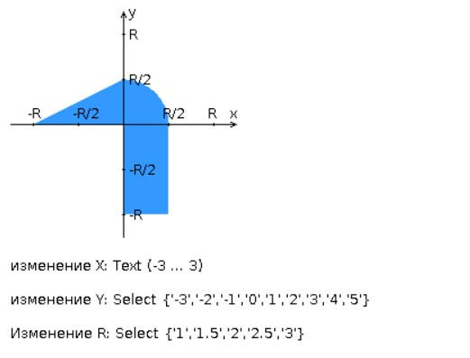

# Лабораторная работа #1
### Вариант 3216

Разработать PHP-скрипт, определяющий попадание точки на координатной плоскости в заданную область, и создать HTML-страницу, которая формирует данные для отправки их на обработку этому скрипту.  

Параметр R и координаты точки должны передаваться скрипту посредством HTTP-запроса. Скрипт должен выполнять валидацию данных и возвращать HTML-страницу с таблицей, содержащей полученные параметры и результат вычислений - факт попадания или непопадания точки в область. Предыдущие результаты должны сохраняться между запросами и отображаться в таблице. 

Кроме того, ответ должен содержать данные о текущем времени и времени работы скрипта.

__Разработанная HTML-страница должна удовлетворять следующим требованиям:__
- Для расположения текстовых и графических элементов необходимо использовать блочную верстку.
- Данные формы должны передаваться на обработку посредством POST-запроса.
- Таблицы стилей должны располагаться в самом веб-документе.
- При работе с CSS должно быть продемонстрировано использование селекторов элементов, селекторов атрибутов, селекторов псевдоклассов, селекторов классов а также такие свойства стилей CSS, как наследование и каскадирование.
- HTML-страница должна иметь "шапку", содержащую ФИО студента, номер группы и новер варианта. При оформлении шапки необходимо явным образом задать шрифт (monospace), его цвет и размер в каскадной таблице стилей.
- Отступы элементов ввода должны задаваться в пикселях.
- Страница должна содержать сценарий на языке JavaScript, осуществляющий валидацию значений, вводимых пользователем в поля формы. Любые некорректные значения (например, буквы в координатах точки или отрицательный радиус) должны блокироваться.

[Посмотреть результат](https://se.ifmo.ru/~s312439/Lab1/)